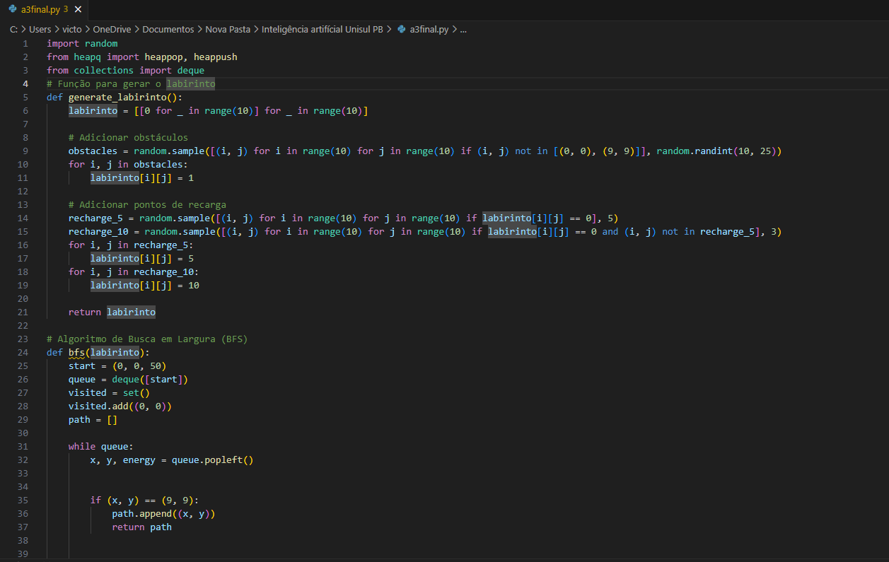
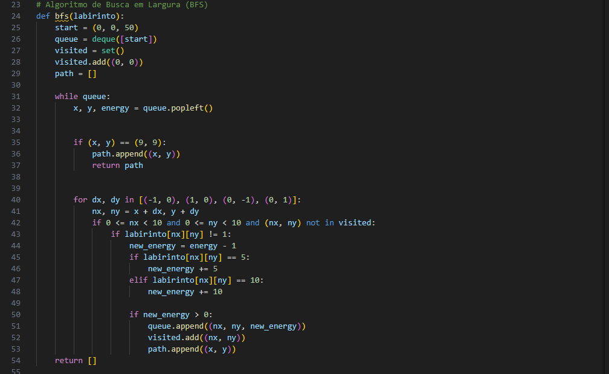
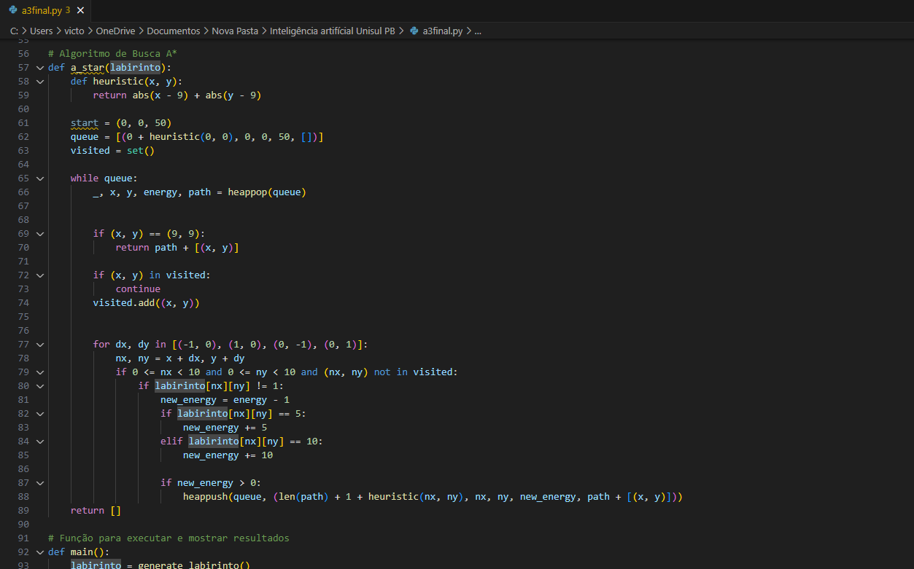
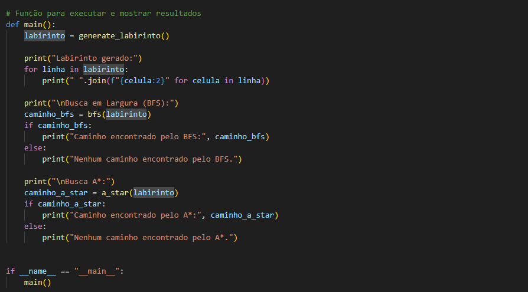
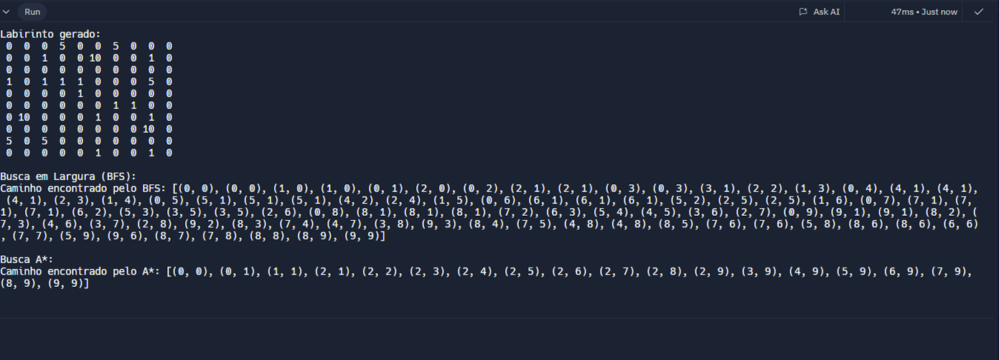

# Trabalho final de Inteligência Artificial

Este código é uma implementação de um labirinto com algoritmos de busca (BFS e A*) para encontrar um caminho da posição inicial (0, 0) até a saída (9, 9), respeitando restrições de energia e utilizando recargas no caminho.

### Geração do labirinto

função <code>generate_labirinto</code>: Cria um labirinto 10x10 representado por uma matriz. Cada célula pode conter:  

  - 0: Caminho livre.
  - 1: Obstáculo (não atravessável).
  - 5 e 10: Pontos de recarga de energia (+5 ou +10, respectivamente).
- Obstáculos são adicionados aleatoriamente entre 10 e 25 células.
- Pontos de recarga são posicionados em células livres, com 5 células de recarga de 5 e 3 células de recarga de 10.

### Algoritmo de Busca em Largura(BFS)

- Explora o labirinto a partir da posição inicial (0, 0) com energia inicial 50.
- Utiliza uma fila (queue) para visitar cada célula.
- Registra células visitadas para evitar loops.
- Movimenta-se nas direções ortogonais, consumindo 1 unidade de energia por passo.
- Se encontrar um ponto de recarga, aumenta a energia disponível.
- O algoritmo retorna o caminho até (9, 9) ou indica que não há caminho viável se a energia acabar antes.

### Algoritmo de Busca A*

- Usa uma *heurística* (distância Manhattan até a saída) para priorizar caminhos promissores.
- Implementado com uma fila de prioridade (min-heap) para sempre explorar o caminho de menor custo.
- Considera as mesmas regras de energia e recarga que o BFS.
- Retorna o caminho mais eficiente até (9, 9) ou indica que não há caminho.

### Função Main

- Gera o labirinto e exibe sua configuração.
- Executa os algoritmos BFS e A*, exibindo os resultados de cada um.
- Permite comparar os desempenhos e soluções encontradas por ambos os métodos.

### Exemplo de saída

Após a geração do labirinto e execução dos algoritmos, você verá:  

1. A configuração do labirinto (com 0, 1, 5, 10).
2. O caminho encontrado pelo BFS.
3. O caminho encontrado pelo A*.

## Contribuição

1. **Clone project**: `git clone https://github.com/viktor1v9/A3-artificial-intelligence.git`

## Licença

Este software está disponível sob as seguintes licenças:

- [MIT](LICENSE)